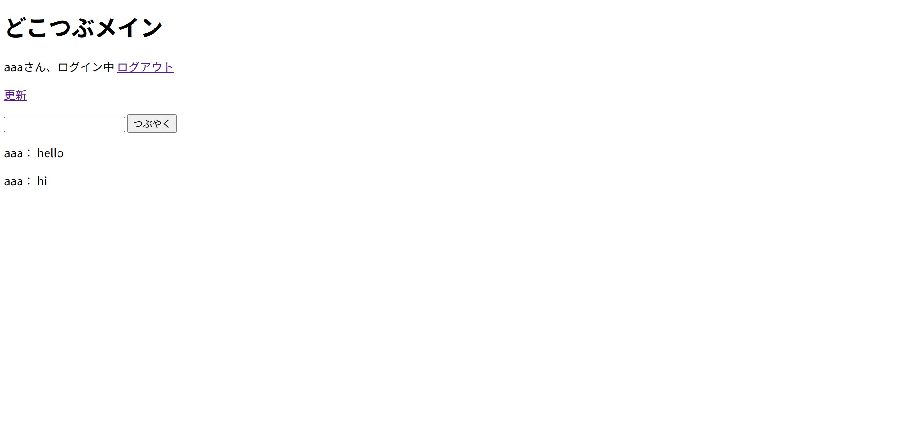

# dokotsubu-app
A simple web application with login and posting features built with Java (Servlet/JSP) and Python (Flask).
# つぶやきアプリ（Java版）

## 概要
Java（Servlet/JSP）を使用して作成した簡易SNSアプリです。  
ログイン機能・投稿機能・一覧表示機能を実装しています。

## 機能
・ログイン機能  
・ログアウト機能  
・投稿機能  
・投稿一覧表示  

## 使用技術
・Java（Servlet/JSP）  
・Apache Tomcat  
・HTML / JSP  

## 作成背景
医療事務として電子カルテ導入に関わる中でITに興味を持ち、  
学習のアウトプットとして作成しました。

## 今後
Python（Flask）版の実装にも取り組む予定です。

## 画面イメージ

### トップ画面

### ログイン画面

### ログイン成功

### メイン画面

### ログイン失敗

### ログアウト

